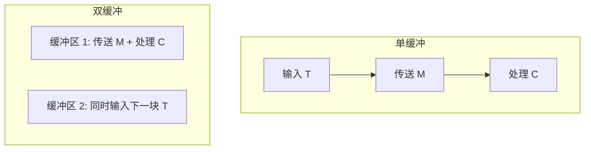
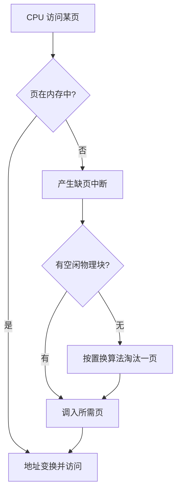
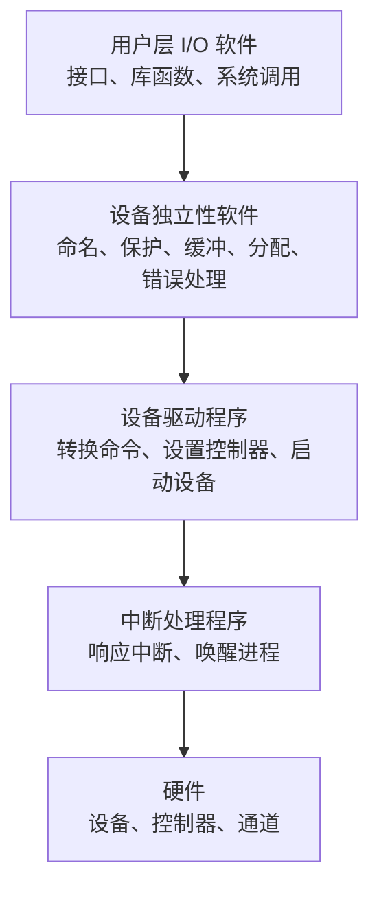
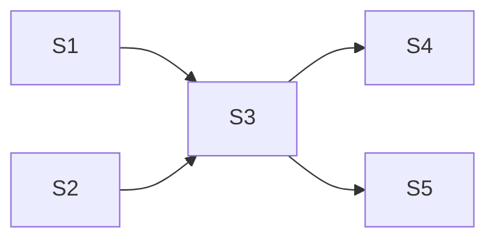

# 简答题理解与记忆版

资料依据：根目录考试要求、复习要点、作业题参考、课程 PPT。这里按老师复习单中的 11 个简答题整理，先讲“怎么理解”，再给“怎么记”。

## 1. 虚拟设备与 SPOOLing

虚拟设备就是用软件和磁盘缓冲，把一台独占设备变成多台逻辑设备，让多个进程“感觉自己都在用这台设备”。典型例子是打印机：真实打印机一次只能给一个进程用，但系统先把每个进程的打印内容放到磁盘输出井，再排队慢慢打印。

SPOOLing 由输入井和输出井、输入缓冲区和输出缓冲区、输入进程和输出进程组成。输入时，输入进程把输入设备上的程序和数据经输入缓冲区送入输入井；程序需要数据时从输入井取。输出时，用户进程把输出数据送到输出井，输出设备空闲后，输出进程再经输出缓冲区送到真实设备。

记忆：`井、缓、进程` 三件套；输入走 `设备 -> 缓冲区 -> 输入井 -> 内存`，输出走 `内存 -> 输出井 -> 缓冲区 -> 设备`。

## 2. 为什么引入进程，进程与程序的区别和联系

多道程序并发执行时会共享资源，程序执行会出现互相制约、走走停停、异步推进等动态现象。单靠“程序”这个静态概念不能描述这些变化，所以引入“进程”来描述程序的一次动态执行过程。

区别：进程是动态的，程序是静态的；进程有独立性，可以并发执行，程序本身不能并发执行；进程和程序没有一一对应关系；进程异步运行，会互相制约，程序不具备这种特征。

联系：进程不能脱离程序而存在，程序规定了进程要完成的动作。

记忆：区别背 `动静、并发、一一、异步`；联系背 `进程依附程序，程序规定动作`。

## 3. 单缓冲和双缓冲

设 `T` 为设备输入一块数据到缓冲区的时间，`M` 为从缓冲区送到用户区的时间，`C` 为 CPU 处理一块数据的时间。

单缓冲只有一个缓冲区。设备把一块数据输入缓冲区后，要先把它传到用户区，用户进程才能处理；下一块输入可以和上一块处理部分重叠，但传送 `M` 这一段通常要单独算。因此每块数据平均处理时间常写为 `max(T, C) + M`。

双缓冲有两个缓冲区，设备输入下一块时，用户进程可以对上一块进行传送和处理，两个缓冲区交替使用。因此每块数据平均处理时间常写为 `max(T, C + M)`。

$$
\text{单缓冲每块时间} = \max(T, C) + M
$$

$$
\text{双缓冲每块时间} = \max(T, C + M)
$$

记忆：单缓冲 `输入和处理比谁慢，再加搬运 M`；双缓冲 `输入一路，搬运+处理一路，两路取最大`。

## 4. 请求页式管理

请求页式管理把用户逻辑地址空间分成页，把内存分成同样大小的物理块，通过页表建立虚页到实页的对应关系。程序运行时，不要求所有页面一次性装入内存，只在访问到某页且该页不在内存时产生缺页中断，再把所需页调入；如果内存已满，还要按置换算法淘汰某页。

它能满足的需要：扩大用户可用内存的需要；实现内存和外存的统一管理；提高内存利用率；不要求作业连续存放，减少或解决碎片问题。

记忆：`分页 + 缺页中断 + 调入/置换` 是定义；优点背 `扩内存、统一管、高利用、不连续`。

## 5. 虚拟存储器

虚拟存储器是操作系统提供的一个假想的特大存储器，是通过内外存交换技术在逻辑上对物理内存进行扩充。系统根据程序执行情况把页面或段换入、换出，用户感觉自己拥有比真实内存大得多的地址空间。

特点：虚拟性，即逻辑容量大于实际内存；离散性，即程序可以分散装入内存；多次性，即作业不必一次全部装入；对换性，即运行中可以在内存和外存之间换入换出。它的依据是程序局部性原理。

$$
\text{逻辑上可用空间} > \text{实际物理内存空间}
$$

为什么能扩大：因为程序运行时通常只访问当前一部分内容，系统只把需要的部分调入内存，其余部分保存在外存，需要时再调入，所以从逻辑上扩大了内存空间。但容量不是无限的，受地址结构和外存容量等限制，也要付出换入换出的时间代价。

记忆：特点背 `虚、离、多、换`；原因背 `局部性，只装当前要用的页`。

## 6. 死锁条件与解决措施

死锁的四个必要条件：互斥条件、不剥夺条件、请求和保持条件、循环等待条件。

含义：互斥是资源一次只能被一个进程使用；不剥夺是资源未用完前不能被强行夺走；请求和保持是进程已占有部分资源又继续等待新资源；循环等待是存在进程和资源的环形等待链。

解决措施：死锁预防，即破坏四个必要条件中的某些条件；死锁避免，即动态分配资源时防止系统进入不安全状态，典型方法是银行家算法；死锁检测及解除，即允许死锁可能发生，检测到后通过撤销进程、剥夺资源等方法解除。

记忆：条件背 `互、不、请、循`；措施背 `预防、避免、检测解除`。

## 7. 多道程序设计技术

多道程序设计是把多个程序同时存放在内存中，使它们都处于运行过程中，共享处理器时间、外部设备和其他资源。

特点：多道、宏观上并行、微观上串行。多道是内存中同时有多道相互独立的程序；宏观上并行是从整体观察多个程序都在推进；微观上串行是在单处理机上任一时刻只有一道程序占用 CPU，各程序轮流交替执行。

记忆：定义背 `多个程序同时在内存，共享 CPU 和设备`；特点背 `多、宏并、微串`。

## 8. I/O 系统层次模型

常用层次从上到下可写为：用户层 I/O 软件、设备独立性软件、设备驱动程序、中断处理程序、硬件。

用户层 I/O 软件负责向用户程序提供 I/O 接口、库函数和系统调用入口。设备独立性软件负责统一命名、保护、缓冲、分配、错误处理，并把逻辑设备映射为物理设备。设备驱动程序负责把上层的抽象 I/O 请求转换成具体设备命令，设置控制器寄存器并启动设备。中断处理程序负责响应设备中断、保存和恢复现场、唤醒等待进程。硬件层包括设备、控制器、通道等，真正完成数据传输。

记忆：从用户到硬件背 `用户、独立、驱动、中断、硬件`；职责背 `接口、统一、命令、中断、传输`。

## 9. 用信号量描述前趋关系

前趋关系表示某些操作必须先完成，后面的操作才能开始。做题时把每一条前趋边 `Si -> Sj` 看成一个同步条件，为它设置一个信号量 `aij`，初值为 0。

规则：前驱操作 `Si` 完成后执行 `V(aij)`，表示条件已经满足；后继操作 `Sj` 开始前执行 `P(aij)`，表示等待前驱完成。如果一个结点有多个前驱，就在它开始前对对应的多个信号量都执行 `P`；如果一个结点有多个后继，就在它完成后对对应的多个信号量都执行 `V`。

若边为 `Si -> Sj`，则：

$$
Si \text{ 完成后执行 } V(a_{ij}), \quad Sj \text{ 开始前执行 } P(a_{ij})
$$

记忆：`边建信号量，前 V 后 P，多前驱多 P，多后继多 V`。

## 10. 批处理、分时、实时操作系统

批处理系统特点：脱机、多道、成批处理。用户提交作业后直到获得结果前几乎不与计算机交互；系统从后备作业中选取多道作业调入内存自动运行。

分时系统特点：多路性、交互性、独占性、及时性。多台终端用户同时或基本同时使用计算机；用户联机交互；由于时间片轮转，每个用户感觉像独占计算机；系统能较快响应请求。

实时系统特点：及时性和高可靠性。系统要及时响应外部事件，并在规定时间内完成处理；由于用于生产控制、航空订票等场合，必须安全可靠。

记忆：批处理 `脱、多、批`；分时 `多、交、独、及`；实时 `及时、可靠`。

## 11. 磁盘调度算法

FCFS 先来先服务：按请求到达顺序访问磁道，公平、简单，但平均寻道距离可能较大。

SSTF 最短寻道时间优先：每次选择离当前磁头位置最近的请求，平均寻道距离较小，但可能使远处请求长期等待。

SCAN 扫描算法，也叫电梯算法：磁头沿一个方向移动，遇到请求就处理，到达边缘或该方向无请求后再反向。它兼顾距离和方向，能缓解 SSTF 的饥饿问题。

计算方法：写出访问顺序，再把相邻磁道号差的绝对值相加。若题目给了方向，SCAN 必须按方向做；若没有给方向，答题时要说明假设方向。

$$
\text{磁头移动总量} = \sum_{i=1}^{n-1} |track_{i+1} - track_i|
$$

记忆：FCFS `按队列`；SSTF `找最近`；SCAN `电梯同向扫`。
